<h1>Compte rendu TP</h1>

Ce TP a le but d'appliquer les différents méthodes d'injections des dépendances

<h2>Structure du projet</h2>

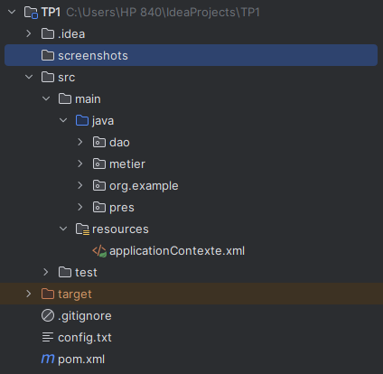
<h2>Interface IDao</h2>

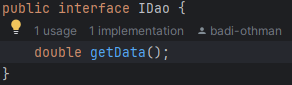
<h2>Implementation de IDao</h2>

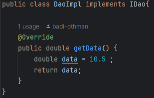
<h2>Interface IMetier</h2>

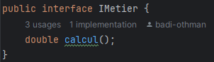
<h2>Implementation de IMetier</h2>

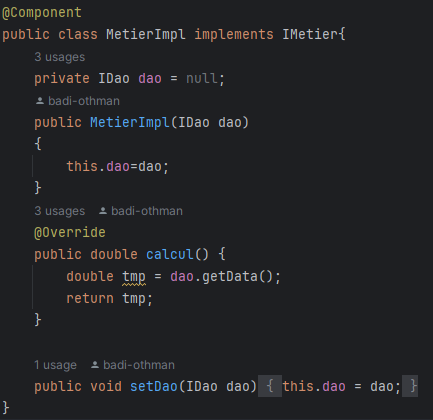
<h2>Méthode statique</h2>

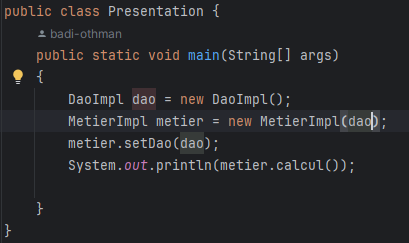
<h2>Méthode dynamique</h2>

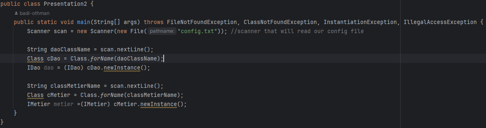
<h2>Fichier config</h2>

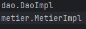
<h2>Méthode Spring XML</h2>

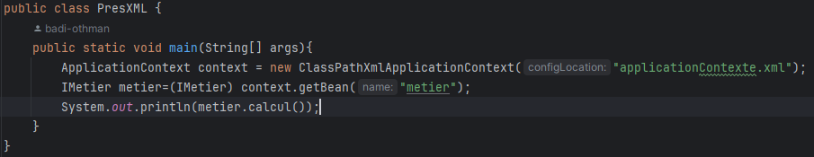
<h2>Fichier contexte XML</h2>

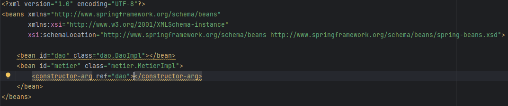
<h2>Méthode annotation</h2>

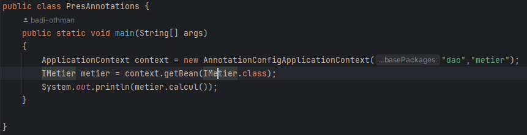